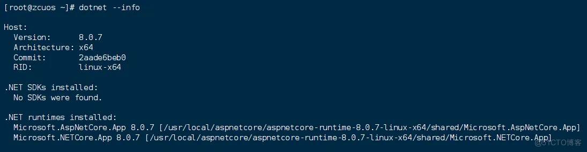

# Linux 创建软链接

## 1.什么是软链接
软链接：也称为符号链接或 symlink；软链接就像是 Windows 系统中的快捷方式。
通过把软链接创建到环境变量中已有的目录中，就可以直接使用这个可执行文件的软链接。

## 2.软链接目录
当你在命令行中输入一个命令时，系统会根据 PATH 环境变量中定义的目录顺序来搜索这个命令对应的可执行文件。
查看环境变量 PATH。

```bash
echo $PATH
```

输出：/usr/local/sbin:/usr/local/bin:/usr/sbin:/usr/bin:/root/bin
则 /usr/loca/bin/ 目录已经在环境变量中，我们可以把软链接创建到这个目录中。

## 3.创建软链接

例如可执行文件路径为：/usr/local/aspnetcore/aspnetcore-runtime-8.0.7-linux-x64/dotnet
则通过以下命令创建：

```bash
ln -s /usr/local/aspnetcore/aspnetcore-runtime-8.0.7-linux-x64/dotnet /usr/local/bin/dotnet
```
## 4.使用软链接
输入你的可执行文件，查看是否可以执行。

```bash
dotnet --info
```



> 来源：微信公众号“A子辰”（ID：q751701133）综合整理自 baidu.com
> 编辑：Zichen
> 校对：Zichen
> 终审：Zichen

<center>
End.
</br>
谢谢您的阅读！
</center>

