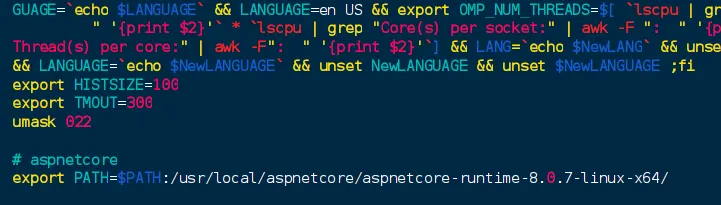
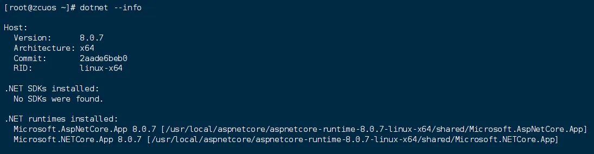

# Linux 添加环境变量

## 1.添加环境变量

编辑环境变量配置文件。

```bash
vim /etc/profile
```

在最后面新增一行，导出 PATH 变量并在之前的 PATH 变量后面添加冒号，然后添加上你的可执行文件的目录。

```bash
export PATH=$PATH:/usr/local/aspnetcore/aspnetcore-runtime-8.0.7-linux-x64/
```



## 2.加载环境变量

保存环境变量配置文件后，重新加载配置文件生效。

```bash
source /etc/profile
```

输入你的可执行文件，查看是否可以访问。

```bash
dotnet --info
```



> 来源：微信公众号“A子辰”（ID：q751701133）综合整理自 baidu.com
> 编辑：Zichen
> 校对：Zichen
> 终审：Zichen

<center>
End.
</br>
谢谢您的阅读！
</center>


