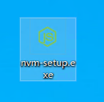
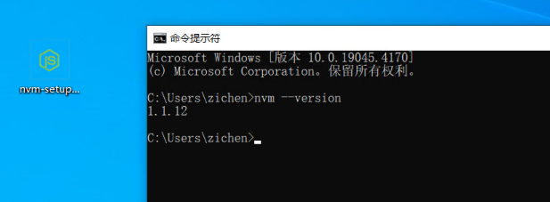

# Windows 安装 nvm

## 1.nvm 介绍

nvm（Node Version Manager）是一个用于管理和切换不同版本的 Node.js 的命令行工具。使用 nvm，你可以在同一台机器上安装

并运行多个版本的 Node.js，而不会造成版本之间的冲突。

## 2.下载 nvm

*网络不好的直接用这个网盘地址下载：[https://zicl.lanzoue.com/iJTVf263s0xi](https://zicl.lanzoue.com/iJTVf263s0xi)

nvm Windows 版本下载地址：[https://github.com/coreybutler/nvm-windows](https://github.com/coreybutler/nvm-windows)

选择 Releases 中发布的最新版本：[https://github.com/coreybutler/nvm-windows/releases/tag/1.1.12](https://github.com/coreybutler/nvm-windows/releases/tag/1.1.12)


选择下载 Windows exe 安装程序。


## 3.安装 nvm

运行安装程序。




安装完成，查看 nvm 版本。



## 4.使用 nvm

查看电脑安装的所有 Node.js 版本。

```bash
nvm list
```

或

```bash
nvm ls
```


查看可以安装的所有 Node.js 的版本。

```bash
nvm list available
```


安装指定版本的 Node.js。

```bash
nvm install 18.17.1
```


再安装一个最新版本。

```bash
nvm install 20.14.0
```


查看所有安装的 Node.js 版本。

```bash
nvm ls
```

使用 20.14.0 版本的 Node.js。

```bash
nvm use 20.14.0
```

nvm ls 查看前面有 * 号的即为当前使用的 Node.js 版本。


查看 Node.js 版本。

```bash
node --version
```


> 来源：微信公众号“A子辰”（ID：q751701133）综合整理自 github
> 编辑：Zichen
> 校对：Zichen
> 终审：Zichen

<center>
End.
</br>
谢谢您的阅读！
</center>

