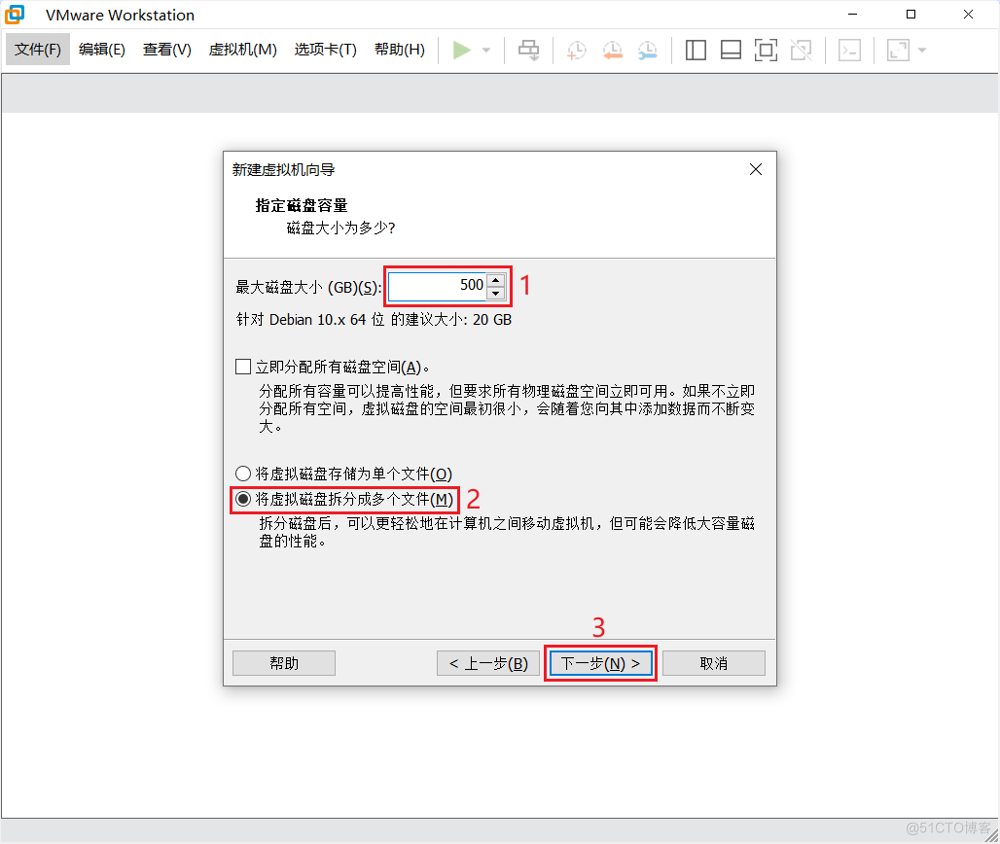

# 统信服务器

## VMware 虚拟机安装统信服务器

## 1.下载 ISO 文件

进入统信官网：[https://www.uniontech.com](https://www.uniontech.com)，下载统信服务器安装 ISO 文件。

下载速度太慢了，复制下载链接，使用迅雷下载。

迅雷下载速度良好。

## 2.创建虚拟机

打开 VMware Workstation Pro 软件，创建虚拟机。

基于 Debian 10。

## 3.安装配置

开启虚拟机，安装统信服务器。

swap 建议为内存大小的 1~2 倍。

连接的是这个 VMnet8 网络。

## 4.访问网站

浏览器访问网站，正常连接网络。

> 来源：微信公众号“A子辰”（ID：q751701133）综合整理自 uniontech.com、csdn.net
> 编辑：Zichen
> 校对：Zichen
> 终审：Zichen

End.
 
谢谢您的阅读！

